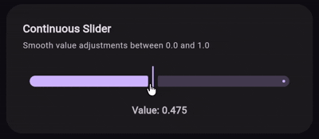
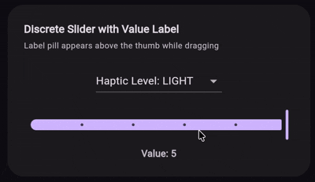
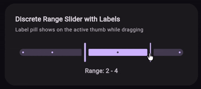
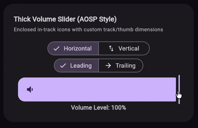
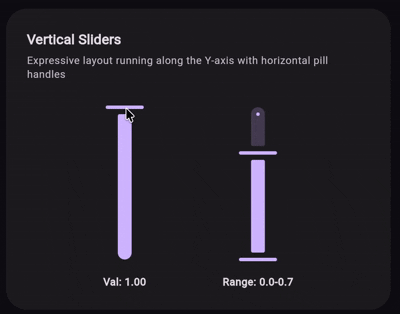

# M3E Slider


A Flutter package providing expressive, Material 3 slider and range slider components. Features smooth spring-driven animations, haptic feedback on tick crossing, snap-to-tick behaviors, dock animations for in-track icons, and rich customization via `M3ESliderDecoration`.

It provides two slider variants (single thumb and range) that support continuous and discrete modes with horizontal and vertical orientations. In-track icons with dock animation, label pills, keyboard navigation, and full disabled state styling are all built-in.

---

## 🎮 Interactive Demo

You can try out the package demo here: [m3e_core demo](https://mudit200408.github.io/m3e_core/)

---

## 🚀 Features

- **Continuous & Discrete Modes** — smooth value selection or snap-to-tick with divisions
- **Range Slider** — dual-thumb range selection with independent keyboard focus
- **Vertical Orientation** — full support for vertical layout on both slider and range slider
- **Track Icons** — in-track icon with dock animation that follows the thumb
- **Spring-driven Motion** — expressive motion presets via `M3EMotion` for snap animations
- **Haptic Feedback** — light, medium, or heavy impact on tick crossing during drag
- **Label Pill** — animated pill above the active thumb while dragging
- **Keyboard Navigation** — arrow keys, page up/down, home/end for accessibility
- **Color Theming** — full color token set via `M3ESliderColors` for active, inactive, and disabled states
- **Custom Decoration** — track height, corner radius, thumb width/height, icon size and colors

---

## 📦 Installation

```yaml
dependencies:
  m3e_slider: ^0.0.3
```

```dart
import 'package:m3e_slider/m3e_slider.dart';
```

---

## 🧩 Quick Start

### Continuous Slider



```dart
M3ESlider(
  value: _value,
  onChanged: (v) => setState(() => _value = v),
)
```

### Discrete Slider with Label



```dart
M3ESlider(
  value: _discreteVal,
  min: 0.0,
  max: 5.0,
  divisions: 5,
  label: _discreteVal.round().toString(),
  onChanged: (v) => setState(() => _discreteVal = v),
)
```

### Range Slider



```dart
M3ERangeSlider(
  value: _range,
  onChanged: (v) => setState(() => _range = v),
)
```

### Custom Volume Slider with Icon



```dart
M3ESlider(
  value: _volumeVal,
  icon: const Icon(Icons.volume_down),
  trailingIcon: true,
  onChanged: (v) => setState(() => _volumeVal = v),
  decoration: M3ESliderDecoration(
    trackHeight: 56.0,
    trackCornerRadius: 16.0,
    thumbWidth: 6.0,
    thumbHeight: 68.0,
    colors: M3ESliderColors(
      thumbColor: cs.primary,
      activeTrackColor: cs.primary,
      inactiveTrackColor: cs.primary.withValues(alpha: 0.15),
      disabledActiveTrackColor: Colors.grey,
      disabledInactiveTrackColor: Colors.grey.withValues(alpha: 0.12),
      activeTickColor: Colors.transparent,
      inactiveTickColor: Colors.transparent,
      disabledActiveTickColor: Colors.transparent,
      disabledInactiveTickColor: Colors.transparent,
    ),
  ),
)
```

### Vertical Slider



```dart
M3ESlider(
  value: _verticalVal,
  orientation: Axis.vertical,
  onChanged: (v) => setState(() => _verticalVal = v),
)
```

---

## 📖 Detailed API Guide

### 1. `M3EMotion`

Spring physics configuration with 12 built-in presets and custom spring support.

#### 🏗️ Spatial Presets (Shape Morphing)
Used for animating container shape and layout transitions.

| Preset | Stiffness | Damping | Description |
|--------|-----------|---------|-------------|
| `standardSpatialFast` | `1400` | `0.9` | Snappy spring for responsive feel |
| `standardSpatialDefault` | `700` | `0.9` | Balanced spring for general use |
| `standardSpatialSlow` | `300` | `0.9` | Relaxed spring for dramatic feel |
| `expressiveSpatialFast` | `800` | `0.6` | Bouncier spring for expressive feel |
| `expressiveSpatialDefault` | `380` | `0.8` | Bouncy, balanced spring |
| `expressiveSpatialSlow` | `200` | `0.8` | Very bouncy for dramatic feel |

#### ✨ Effects Presets (Opacity/Scale)
Used for content animations like cross-fades.

| Preset | Stiffness | Damping | Description |
|--------|-----------|---------|-------------|
| `standardEffectsFast` | `3800` | `1.0` | Snappy effect animation |
| `standardEffectsDefault` | `1600` | `1.0` | Balanced effect animation |
| `standardEffectsSlow` | `800` | `1.0` | Relaxed effect animation |
| `expressiveEffectsFast` | `3800` | `1.0` | Snappy expressive effect |
| `expressiveEffectsDefault` | `1600` | `1.0` | Balanced expressive effect |
| `expressiveEffectsSlow` | `800` | `1.0` | Relaxed expressive effect |

#### 🛠️ Custom Motion

```dart
M3EMotion.custom(stiffness: 1200, damping: 0.75)
```

---

### 2. `M3EHapticFeedback`

Haptic feedback intensity levels for slider interactions.

| Level | Value | Description |
|-------|-------|-------------|
| `none` | `0` | No haptic feedback (default) |
| `light` | `1` | Light tap feedback |
| `medium` | `2` | Medium impact feedback |
| `heavy` | `3` | Heavy impact feedback |

```dart
M3ESliderDecoration(haptic: M3EHapticFeedback.medium)
```

---

### 3. `M3ESliderColors`

Full color token set for slider components.

| Field | Type | Description |
|-------|------|-------------|
| `thumbColor` | `Color` | Thumb color when enabled |
| `disabledThumbColor` | `Color` | Thumb color when disabled |
| `activeTrackColor` | `Color` | Track segment from min to thumb |
| `inactiveTrackColor` | `Color` | Track segment from thumb to max |
| `disabledActiveTrackColor` | `Color` | Active track when disabled |
| `disabledInactiveTrackColor` | `Color` | Inactive track when disabled |
| `activeTickColor` | `Color` | Tick marks on the active side |
| `inactiveTickColor` | `Color` | Tick marks on the inactive side |
| `disabledActiveTickColor` | `Color` | Active tick marks when disabled |
| `disabledInactiveTickColor` | `Color` | Inactive tick marks when disabled |

Use `M3ESliderDefaults.colors(context)` for theme-derived colors:

```dart
M3ESliderDecoration(
  colors: M3ESliderColors(
    thumbColor: Colors.teal,
    activeTrackColor: Colors.teal,
    inactiveTrackColor: Colors.teal.withValues(alpha: 0.15),
    disabledThumbColor: Colors.grey,
    disabledActiveTrackColor: Colors.grey,
    disabledInactiveTrackColor: Colors.grey.withValues(alpha: 0.12),
    activeTickColor: Colors.white.withValues(alpha: 0.6),
    inactiveTickColor: Colors.teal.withValues(alpha: 0.6),
    disabledActiveTickColor: Colors.grey,
    disabledInactiveTickColor: Colors.grey,
  ),
)
```

---

### 4. `M3ESliderDecoration`

Styling and haptic overrides for all slider variants.

| Parameter | Type | Default | Description |
|-----------|------|---------|-------------|
| `colors` | `M3ESliderColors?` | Theme-derived | Custom color tokens |
| `haptic` | `M3EHapticFeedback?` | `none` | Haptic feedback level on tick crossing |
| `trackHeight` | `double?` | `16.0` | Height of the slider track |
| `trackCornerRadius` | `double?` | `trackHeight / 2` | Corner radius of the track |
| `thumbWidth` | `double?` | `4.0` | Width of the thumb pill |
| `thumbHeight` | `double?` | `44.0` | Height of the thumb pill |
| `trackIconSize` | `double?` | `24.0` | Size of the in-track icon |
| `trackIconActiveColor` | `Color?` | `cs.primary` | Icon color on the active track segment |
| `trackIconInactiveColor` | `Color?` | `cs.onSurfaceVariant` | Icon color on the inactive track segment |

```dart
M3ESliderDecoration(
  haptic: M3EHapticFeedback.medium,
  trackHeight: 56.0,
  trackCornerRadius: 16.0,
  thumbWidth: 6.0,
  thumbHeight: 68.0,
  trackIconSize: 24.0,
  colors: M3ESliderColors(
    thumbColor: cs.primary,
    activeTrackColor: cs.primary,
    inactiveTrackColor: cs.primary.withValues(alpha: 0.15),
    // ... remaining color tokens
  ),
)
```

---

### 5. Slider Widgets

#### `M3ESlider`

Single-thumb slider with continuous and discrete modes.

| Parameter | Type | Default | Description |
|-----------|------|---------|-------------|
| `value` | `double` | — | Current slider value |
| `onChanged` | `ValueChanged<double>?` | — | Called while the value is changing |
| `onChangeStart` | `ValueChanged<double>?` | — | Called when drag starts |
| `onChangeEnd` | `ValueChanged<double>?` | — | Called when drag ends (after snap) |
| `min` | `double` | `0.0` | Minimum value |
| `max` | `double` | `1.0` | Maximum value |
| `divisions` | `int?` | — | Number of discrete intervals (`null` = continuous) |
| `enabled` | `bool` | `true` | Whether the slider is interactive |
| `focusNode` | `FocusNode?` | — | Keyboard focus node |
| `autofocus` | `bool` | `false` | Whether to autofocus |
| `decoration` | `M3ESliderDecoration?` | — | Styling and haptic overrides |
| `orientation` | `Axis` | `horizontal` | Layout axis |
| `label` | `String?` | — | Label shown in pill above thumb while pressed |
| `icon` | `Widget?` | — | In-track icon widget |
| `trailingIcon` | `bool` | `true` | Whether icon sits at trailing or leading end |
| `iconSize` | `double?` | `24.0` | Override for icon size |

```dart
M3ESlider(
  value: _value,
  min: 0.0,
  max: 10.0,
  divisions: 10,
  label: _value.round().toString(),
  orientation: Axis.horizontal,
  icon: const Icon(Icons.volume_down),
  trailingIcon: true,
  enabled: true,
  onChanged: (v) => setState(() => _value = v),
  decoration: M3ESliderDecoration(
    haptic: M3EHapticFeedback.light,
    trackHeight: 16.0,
  ),
)
```

#### `M3ERangeSlider`

Dual-thumb range slider with independent keyboard focus for each thumb.

| Parameter | Type | Default | Description |
|-----------|------|---------|-------------|
| `value` | `RangeValues` | — | Current range values |
| `onChanged` | `ValueChanged<RangeValues>?` | — | Called while the range is changing |
| `onChangeStart` | `ValueChanged<RangeValues>?` | — | Called when drag starts |
| `onChangeEnd` | `ValueChanged<RangeValues>?` | — | Called when drag ends (after snap) |
| `min` | `double` | `0.0` | Minimum value |
| `max` | `double` | `1.0` | Maximum value |
| `divisions` | `int?` | — | Number of discrete intervals (`null` = continuous) |
| `enabled` | `bool` | `true` | Whether the slider is interactive |
| `decoration` | `M3ESliderDecoration?` | — | Styling and haptic overrides |
| `orientation` | `Axis` | `horizontal` | Layout axis |
| `startFocusNode` | `FocusNode?` | — | Keyboard focus node for start thumb |
| `endFocusNode` | `FocusNode?` | — | Keyboard focus node for end thumb |
| `autofocus` | `bool` | `false` | Whether to autofocus |
| `label` | `String?` | — | Label shown in pill above active thumb while pressed |

```dart
M3ERangeSlider(
  value: const RangeValues(0.25, 0.75),
  min: 0.0,
  max: 1.0,
  divisions: null,
  label: 'Range',
  orientation: Axis.horizontal,
  enabled: true,
  onChanged: (v) => setState(() => _range = v),
  decoration: M3ESliderDecoration(
    haptic: M3EHapticFeedback.medium,
  ),
)
```

---

### 6. `M3ESliderDefaults`

Design token defaults and factory helpers.

| Constant | Value | Description |
|----------|-------|-------------|
| `trackHeight` | `16.0` | Default track height |
| `thumbRadius` | `10.0` | Default thumb radius |
| `thumbRippleRadius` | `24.0` | Default touch/ripple area radius |
| `thumbWidth` | `4.0` | Default thumb pill width |
| `thumbHeight` | `44.0` | Default thumb pill height |
| `thumbTrackGapSize` | `6.0` | Gap between track and thumb |
| `trackInsideCornerSize` | `2.0` | Inside corner radius facing the thumb |
| `tickSize` | `4.0` | Tick/stop indicator dot size |
| `trackIconSize` | `24.0` | Default in-track icon size |

| Method | Returns | Description |
|--------|---------|-------------|
| `colors(context)` | `M3ESliderColors` | Theme-derived color tokens |
| `trackIconActiveColor(cs)` | `Color` | Default active track icon color |
| `trackIconInactiveColor(cs)` | `Color` | Default inactive track icon color |

---

### 7. Accessibility & Keyboard Navigation

Both `M3ESlider` and `M3ERangeSlider` support full keyboard navigation.

| Key | Action |
|-----|--------|
| ← / ↓ | Decrease value |
| → / ↑ | Increase value |
| Page Up | Increase by 10% of range |
| Page Down | Decrease by 10% of range |
| Home | Jump to minimum |
| End | Jump to maximum |

Range slider thumbs are independently focusable via `startFocusNode` and `endFocusNode`.

---

## 🐞 Found a bug? or ✨ You have a Feature Request?

Feel free to open an [Issue](https://github.com/Mudit200408/m3e_slider/issues) or [Contribute](https://github.com/Mudit200408/m3e_slider/pulls) to the project.

Hope You Love It!

---

## Credits

- [Motor](https://pub.dev/packages/motor) Pub Package for Expressive Animations
- Claude and Gemini for helping me with the code and documentation.

### Radhe Radhe 🙏
